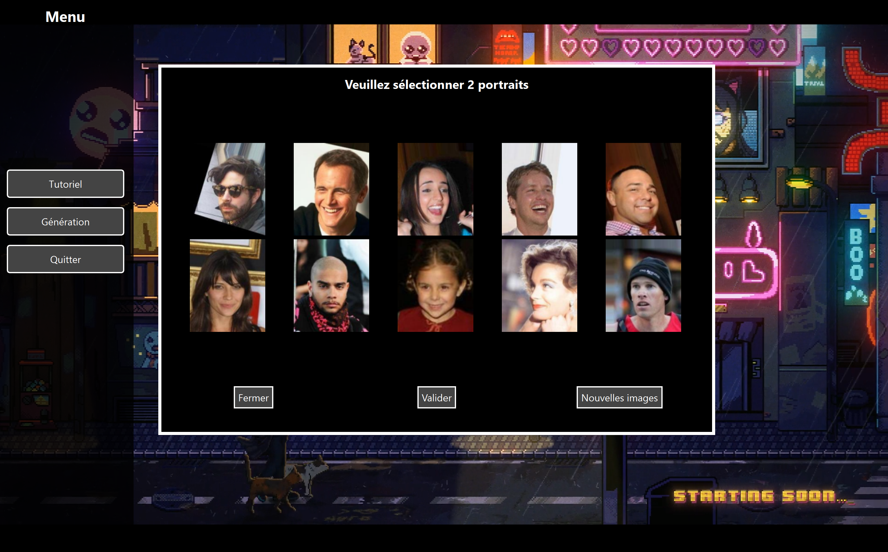

# Projet 4BIM-INSA_LYON-Biotech_Bioinfo

## Nom
PeaceKeeper : Générateur de portrait robot numérique

## Description
Ce projet vise à simplifier la création de portraits robots. 
Pour cela, des images issues de la base de donnée CelebA (https://mmlab.ie.cuhk.edu.hk/projects/CelebA.html, images de visages de célébrités) sont présentés à un utiliseur (la victime) dans une interface graphique. L'utilisateur peut sélectionner deux images afin de les combiner pour en créer de nouvelles. Cette étape est répétée jusqu'à qu'une des combinaisons soit validé par l'utilisateur comme étant assez proche du portrait robot du suspect.

Un Autoencodeur (https://www.ibm.com/fr-fr/think/topics/autoencoder) est utilisé pour encoder les images sélectionnées dans un espace latent (compression des pixels en un vecteur de plus petite taille où chaque coordonnée encode une caractéristique particulère de l'image de base). L'Autoencodeur permet aussi de décoder des vecteurs de l'espace latent en images RGB.

Dans l'objectif de combiner deux images entre elle et de créer de la variabilité, un algorithme génétique (https://igm.univ-mlv.fr/~dr/XPOSE2013/tleroux_genetic_algorithm/fonctionnement.html) est également utilisé pour croiser deux vecteurs entre eux et introduire des mutations dans leurs coordonnées. L'étape de sélection de cette algorithme est directement réalisée à chaque sélection de deux images par l'utilisateur.

## Badges

### Langage de programmation et principaux outils utilisés


## Visuel


## Installation

Ce référer au fichier guide_installation.py pour avoir le détail des étapes à suivre.
Utilisez le package manager [pip](https://pip.pypa.io/en/stable/) pour installer new_inference.

```bash
python3 -m pip install --index-url https://test.pypi.org/simple --extra-index-url https://pypi.org/simple projet-4bim-test-1-agnc==0.1.3
```

## Utilisation

Pour lancer le Programme complet et simuler la création d'un portrait robot :

```python
From projet_4bim_test_1_agnc.Autoencodeur import new_inference
new_inference.main()
```

Ceci lance l'interface graphique qui permet d'afficher quelques images de la base de donnée et commencer les étapes de sélections/modifications.

Pour comprendre la structure des vecteurs de l'espace latent et leur reconstruction en image :

```python
From projet_4bim_test_1_agnc.Autoencodeur import split_latent
method = "interpolation"
split_latent.main(method)
```

Le paramètre method peut être défini comme : "random", "b&w", "interpolation" and "coord". Cela génerera différent type de vecteurs dans l'espace latent afin de mieux comprendre sa structure. Voir la doc de split_latent.py pour plus de détails. Le programme affiche ensuite les images reconstituées à partir des vecteurs générés

Pour comprendre le fonctionnement de l'algorithme génétique :

```python
From projet_4bim_test_1_agnc.AlgoGenetique import user_driven_algo_gen
# ... Definition des paramètres de run_ga (voir ci-dessous)
user_driven_algo_gen.run_ga(targets, nb_solutions, crossover_method, mutation_rate, sigma_mutation)
```

Ceci lance un algorithme génétique et croise les coordonnées des deux images données dans "targets", puis les fais muter. Le programme renvoie la liste des "nb_solutions" vecteurs générés par cet algorithme.
Le croisement se fait selon la méthode donnée dans "crossover_method", et les mutations dépendent de "mutation_rate" et "sigma_mutation". Voir la doc de user_driven_algo_gen.py pour plus de détails.

## Support
Contactez matthieu.deleglise@insa-lyon.fr pour toute question sur l'algorithme génétique.

...

## Pistes d'améliorations
- segmentation du visage pour un meilleur choix des coordonnées à modifier
- selections par l'utilisateurs des parties du visage à modifier
- questionnaire pour une préselection des images dans la base de donnée

## Contribution
Ce code étant open-source, les auteurs sont ouverts à toutes contributions/réutilisations suivant la licence ci-dessous. 

- Dans le code de l'algorithme génétique, vous trouverez de simple fonctions de test que vous pouvez lancer pour vérifier que vos modifications des méthodes de crossover et de mutation fonctionnent. 
- Dans l'autoencodeur, les différents modèles entrainés sont sauvegardés dans des fichiers distincts, vous pouvez donc tenter d'entrainer un nouveau modèle sans risque de perdre le précédent.

Les requêtes de pull sont les bienvenues. Avant toute modification majeure, Veuillez d'abord ouvrir un ticket
pour discuter de ce que vous souhaitez modifier.

## Auteur(e)s et remerciement
- Amrou Anibou 
- Morad Bel Melih
- Matthieu Deléglise
- Julie Durand
- Philippine Fremaux

Nous remercions le tuteur de ce projet, Monsieur Robin Trombetta, pour son aide et ses conseils tout au long du projet

## Licence
Ce projet est placé sous les termes de la licence MIT (Copyright 2025).

## Status du projet
Ce projet a été réalisé en suivant la méthode Agile. Actuellement, il est en fin de deuxième sprint. 
Etant seulement à visé scolaire, il ne sera pas maintenu par la suite. 

## FAQ
Vous trouverez ici les principales questions qui sont posées sur ce projet. Si votre question n'y figure pas, n'hésitez pas à contacter les auteurs pour obtenir une réponse.

...